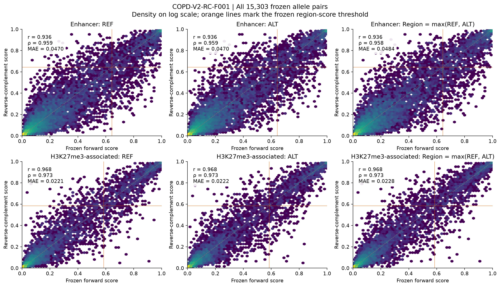
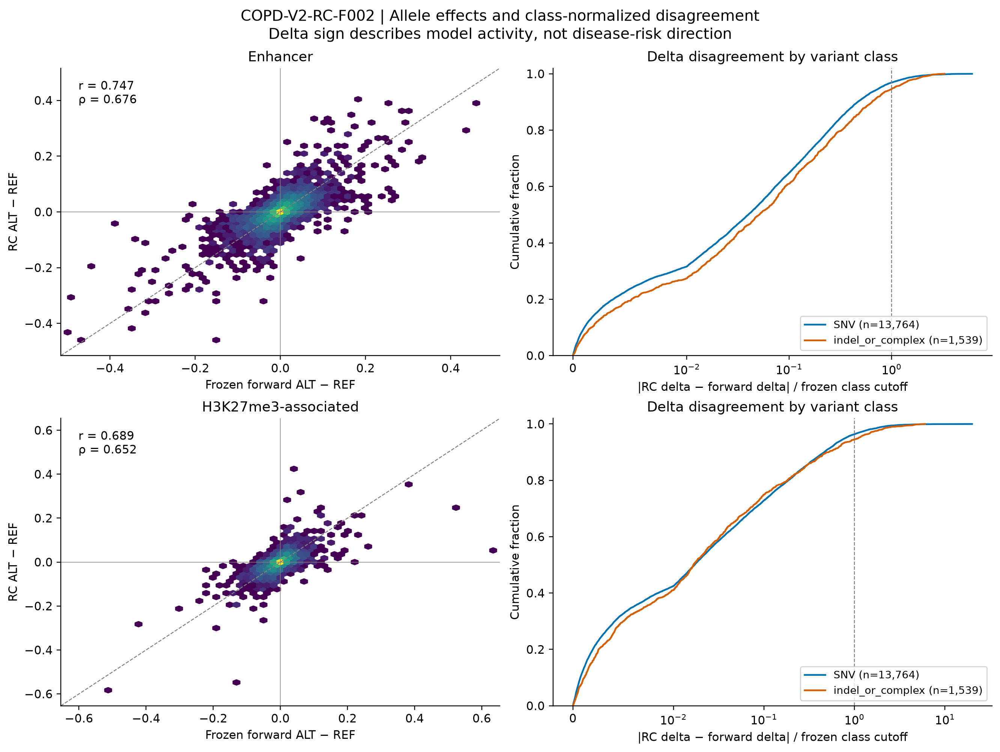
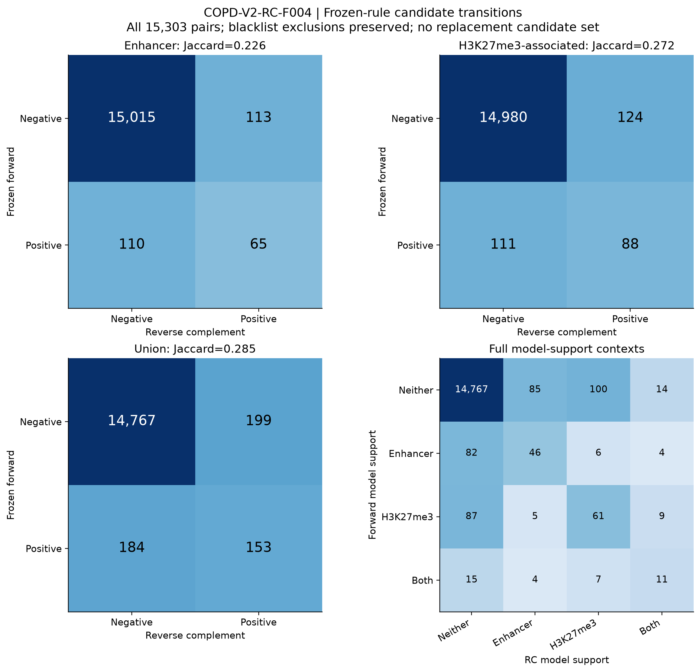
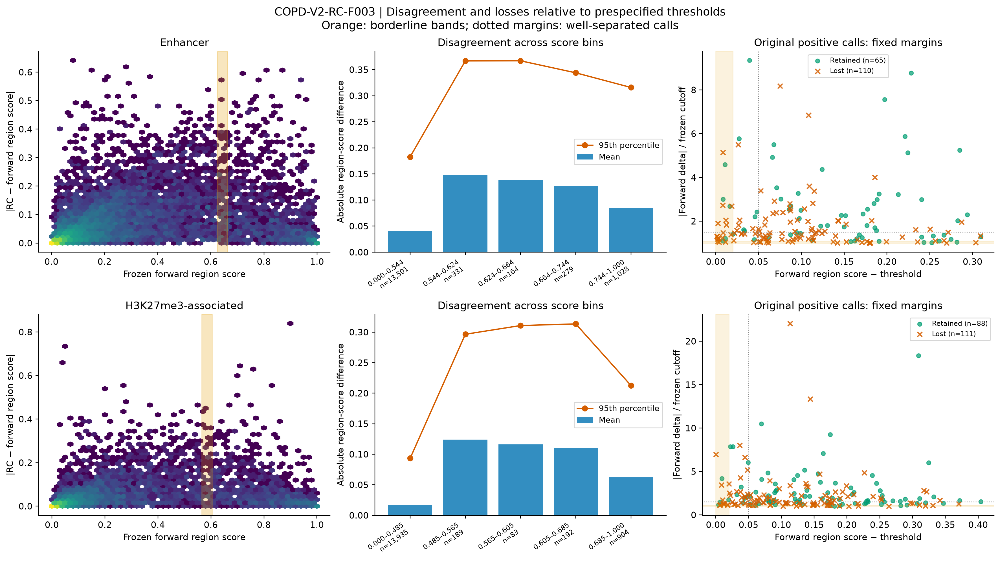

# COPD V2 frozen-model reverse-complement robustness audit

Report ID: COPD-V2-RC-REPORT-001. Completed 2026-10-05. Scope: the investigator-authorized frozen-model orientation diagnostic only.

## Principal finding

**Reverse-complement sensitivity is scientifically material under the prespecified rubric.** Across all 15,303 frozen scorable allele pairs, applying the original decision rule to reverse-complement (RC) inputs retains a union call for only **153/337 V1 candidates (45.40%)**; **184/337 (54.60%) lose all model support**. Only **118/337 (35.01%)** retain the exact enhancer/H3K27me3 support vector. The union Jaccard similarity is **0.2854**.

The result is not restricted to borderline calls: **65/152 well-separated union-positive candidates lose the union call**, and only **89/458 changed model decisions (19.43%)** occur in the prespecified forward borderline bands. Orientation therefore materially weakens confidence in the reproducibility of V1's regulatory nominations and allele-effect interpretation. It does not disprove the underlying variants' biology, alter genetic association evidence, or create an alternative candidate list.

The [locked specification](../provenance/COPD-V2-RC_analysis_specification.md), [all-record comparison](COPD-V2-RC-R004_all_scorable_comparison.tsv.gz), [rank-preserved 337 table](COPD-V2-RC-R005_frozen_337_comparison.tsv), and [12-candidate shortlist table](COPD-V2-RC-R006_shortlist_12_comparison.tsv) are the primary audit artifacts.

## 1. Prespecification, exact inputs and numerical verification

The protocol was written and hashed before any RC inference. Its immutable SHA-256 is `09d3656f3e06c24fa5402c28b976d6be06fff91604ad0b7b29c3150120d76ac1`. The successful preflight lock was recorded at 21:07:33 UTC and the numerical gate passed at 21:08:01 UTC, before RC inference began. The earlier preflight and failed numerical attempt are retained separately.

The exact V1 phase-I model and both phase-II best checkpoints were loaded through the original inference architecture. The phase-II architecture archives were followed by explicit loading of the trained best weights. Exact frozen REF and ALT FASTAs supplied 2,001-base inputs; no sequences were regenerated. All 15,303 scorable pairs were audited, comprising 13,764 SNVs and 1,539 indel/complex records. The original 20 blacklist exclusions remained ineligible for candidate calls, leaving 15,283 eligible pairs (13,747 SNVs; 1,536 indel/complex). All 15,389 original records are reconciled in [R003](COPD-V2-RC-R003_record_reconciliation.tsv): 15,303 scored, 82 unresolved alleles, three missing coordinates and one ambiguous allele.

For each entire sequence, RC reverses the string and complements A↔T, C↔G and N↔N. Biological REF/ALT labels are preserved. The forward allele span [1000,1000+k) maps to [1001−k,1001); a multibase allele must therefore not be recentered. Independent full-string involution, allele-span/anchor and one-hot transformation checks passed for all 30,606 allele sequences. There were **zero N-containing scorable pairs**. The [per-pair transformation QC](COPD-V2-RC-R002_sequence_transformation_qc.tsv.gz) records spans, edge distances and sequence hashes.

The original interpreter symlink was inaccessible. An accessible Python 3.13.7 interpreter used the original TensorFlow 2.20.0, Keras 3.14.1 and NumPy 2.5.0 libraries with the available NVIDIA A100 80 GB GPU. A fixed 142-variant verification panel reproduced V1 forward scores before RC inference. Initial execution in a partial batch gave errors up to 0.000177; the first 128 REF predictions reproduced the originals to approximately 5×10⁻¹⁰, identifying a batch-shape numerical discrepancy. Padding verification execution to 192 entries with repeated existing panel IDs restored full 64-entry minibatches; only the same 142 unique prespecified IDs were assessed. The failed attempt was preserved, and the panel, tolerance and protocol were unchanged. Full RC inference retained V1's original record order, outer batch 256, prediction batch 64 and original final batch shape.

The successful maximum REF/ALT errors were **4.9713×10⁻¹⁰ enhancer** and **4.9734×10⁻¹⁰ H3K27me3**, versus the fixed 10⁻⁵ limit. Maximum delta errors were 9.5984×10⁻¹⁰ and 9.5697×10⁻¹⁰, versus 2×10⁻⁵. Existing V1 scores remained authoritative. See [verification](COPD-V2-RC_forward_verification.tsv), [preserved failed attempt](COPD-V2-RC_forward_verification_attempt1_failed.tsv), [preflight](../provenance/COPD-V2-RC_preflight_manifest.json) and [run log](../logs/COPD-V2-RC_scoring.log).

## 2. Frozen decision rule and severity convention

For each orientation, region score=max(REF score, ALT score) and delta=ALT−REF. Forward deltas were recomputed from authoritative serialized REF/ALT scores, matching V1 R004; the separately serialized R003 delta and its negligible rounding difference remain in the comparison table. A call requires eligibility, region score ≥ T and |delta| ≥ D. Thresholds were never recalibrated:

| Model | Region T | SNV D | Indel/complex D |
|---|---:|---:|---:|
| Enhancer | 0.643623 | 0.05706318769999998 | 0.04936093850000001 |
| H3K27me3-associated | 0.58505 | 0.028802613899999996 | 0.026183359500000003 |

Forward reconstruction recovered exactly 175 enhancer calls, 199 H3K27me3 calls, 37 dual calls and the original 337-candidate union.

The prespecified rubric uses fixed score-scale tolerances, delta error relative to D, positive-set retention/Jaccard and support-vector preservation. A score p95 absolute error ≥0.10 is material; candidate-call Jaccard <0.80 or forward retention <90% is material. Full definitions, including intermediate and negligible criteria, were fixed in the specification. These are descriptive audit conventions, not published universal equivalence margins or causal false-discovery rates. The regulatory-task symmetry rationale is supported by [Zhou, Shrikumar and Kundaje (2022)](https://proceedings.mlr.press/v165/zhou22a.html); that work does not supply the numerical severity bands used here.

All results are descriptive finite-universe comparisons. Linked variants share sequence/LD context and are not independent replicates. RC comparison supplies no experimental labels, so it cannot estimate biological accuracy, AUROC or false discovery.

## 3. Region and allele scores

Each row below includes all 15,303 paired records. Differences are absolute RC-minus-forward score differences, on the models' 0–1 scale.

| Model | Score | Pearson r | Spearman ρ | Mean | Median | p90 | p95 | p99 | Maximum |
|---|---|---:|---:|---:|---:|---:|---:|---:|---:|
| Enhancer | REF | 0.9356 | 0.9587 | 0.0470 | 0.0126 | 0.1426 | 0.2084 | 0.3575 | 0.6413 |
| Enhancer | ALT | 0.9359 | 0.9587 | 0.0470 | 0.0127 | 0.1440 | 0.2059 | 0.3613 | 0.6432 |
| Enhancer | REGION | 0.9360 | 0.9584 | 0.0484 | 0.0135 | 0.1479 | 0.2105 | 0.3574 | 0.6413 |
| H3K27me3-associated | REF | 0.9684 | 0.9731 | 0.0221 | 0.0026 | 0.0655 | 0.1230 | 0.2539 | 0.8391 |
| H3K27me3-associated | ALT | 0.9681 | 0.9734 | 0.0222 | 0.0026 | 0.0663 | 0.1219 | 0.2601 | 0.7833 |
| H3K27me3-associated | REGION | 0.9679 | 0.9732 | 0.0228 | 0.0027 | 0.0680 | 0.1258 | 0.2621 | 0.8391 |

The high global correlations do not establish invariance. Enhancer region differences exceed 0.02 for **43.80%** of records and 0.10 for **16.54%**; H3K27me3 differences exceed these levels for **22.92%** and **6.70%**. Both models meet the material score-domain criterion through their p95 errors. Enhancer region MAE is about 2.1-fold larger, although H3K27me3 has the larger single-record maximum error.

[Complete score metrics by subset](COPD-V2-RC-R009_score_metrics.tsv) also include signed mean differences and all prespecified exceedance rates.



## 4. Allele effects and original forward upper tails

Delta remains ALT−REF after RC; it is model activity direction, not disease-risk direction.

| Model | Pearson r | Spearman ρ | Mean absolute delta error | Median | p90 | p95 | p99 | Maximum |
|---|---:|---:|---:|---:|---:|---:|---:|---:|---:|
| Enhancer | 0.7469 | 0.6760 | 0.009862 | 0.002290 | 0.027031 | 0.044164 | 0.096216 | 0.347858 |
| H3K27me3-associated | 0.6886 | 0.6524 | 0.004816 | 0.000485 | 0.013333 | 0.023369 | 0.059676 | 0.572997 |

Enhancer raw nonzero sign agreement is **12,040/15,303 (78.68%)**, with **1,565 gain→loss** and **1,698 loss→gain** transitions. H3K27me3 agreement is **11,943/15,302 (78.05%)**, with **1,616 gain→loss**, **1,743 loss→gain**, and one forward-nonzero effect collapsing exactly to zero. The complete raw and meaningful-sign transition matrices are in [R011](COPD-V2-RC-R011_sign_transitions.tsv).

With meaningful-sign epsilon=max(2×10⁻⁵,0.1D), direction is retained for 3,974/5,864 enhancer effects (67.77%) and 2,983/4,387 H3K27me3 effects (68.00%). RC near-zero collapse occurs for 1,393 and 961 of these forward-meaningful effects, respectively; opposite meaningful direction occurs for 497 and 443. Thus sign agreement is not inflated by dropping vanished RC effects.

For normalized delta disagreement q=|delta_RC−delta_F|/D, medians are **0.0408 enhancer** and **0.0170 H3K27me3**; p95 values are **0.7898** and **0.8126**. Absolute changes in effect magnitude, ||delta_RC|−|delta_F||, are separately recorded in [R010](COPD-V2-RC-R010_delta_metrics.tsv), with means 0.008679 and 0.004210 and p95 values 0.039793 and 0.019870.

Upper tails were selected exclusively from forward eligible absolute-delta distributions. “Call retention” below refers only to the forward region-and-delta-positive members of each tail, not every tail record.

| Model | Forward tail | n | Delta r / ρ | Meaningful direction retained | RC near-zero | Opposite meaningful direction | Original calls retained |
|---|---|---:|---:|---:|---:|---:|---:|
| Enhancer | Top 5% | 765 | 0.8278 / 0.8376 | 713/765 (93.20%) | 21 | 31 | 65/175 (37.14%) |
| Enhancer | Top 1% | 154 | 0.8649 / 0.8528 | 149/154 (96.75%) | 2 | 3 | 25/42 (59.52%) |
| H3K27me3-associated | Top 5% | 765 | 0.7427 / 0.8137 | 677/765 (88.50%) | 39 | 49 | 88/199 (44.22%) |
| H3K27me3-associated | Top 1% | 154 | 0.7913 / 0.8470 | 144/154 (93.51%) | 4 | 6 | 27/48 (56.25%) |

Under the locked aggregate rubric, the **enhancer delta domain is modest**, while the **H3K27me3 delta domain is material** because its original top-5% meaningful-direction retention is below 90%. The enhancer's aggregate label does not imply stable candidate decisions, and material indel-specific failures are described below. See [all tail metrics](COPD-V2-RC-R012_forward_tail_metrics.tsv) and [forward-only p99 cutoffs](../provenance/COPD-V2-RC_forward_p99_cutoffs.tsv).



## 5. Frozen-rule calls and the original 337

| Call | Forward + | RC + | Both + | Forward-only | RC-only | Neither | Jaccard | Forward retention |
|---|---:|---:|---:|---:|---:|---:|---:|---:|
| Enhancer | 175 | 178 | 65 | 110 | 113 | 15,015 | 0.2257 | 37.14% |
| H3K27me3-associated | 199 | 212 | 88 | 111 | 124 | 14,980 | 0.2724 | 44.22% |
| Union | 337 | 352 | 153 | 184 | 199 | 14,767 | 0.2854 | 45.40% |

These columns define the full 2×2 transition matrices. The **199 RC-only union positives** are diagnostic observations in the original scorable universe; they have not been nominated as replacements or ranked.

Full model-context transitions make support changes visible:

| Forward context → RC context | Neither | Enhancer only | H3K27me3 only | Both |
|---|---:|---:|---:|---:|
| Neither | 14,767 | 85 | 100 | 14 |
| Enhancer only | 82 | 46 | 6 | 4 |
| H3K27me3 only | 87 | 5 | 61 | 9 |
| Both | 15 | 4 | 7 | 11 |

Among the 337, **118 retain exactly the same model support**, **153 retain at least one call**, **206 lose at least one original model call**, **184 lose the union call**, and **24 gain a model call absent in forward orientation**. There are **11 pure support switches**: six enhancer→H3K27me3 and five H3K27me3→enhancer. These categories overlap where a variant both loses one model and gains another. In total, **219/337 change their support vector**. All original ranks are retained in [R005](COPD-V2-RC-R005_frozen_337_comparison.tsv).

The full-universe support-vector agreement is 14,885/15,303=97.27%, but that denominator is dominated by negatives and obscures the 35.01% exact-vector stability among the 337. The complete [call](COPD-V2-RC-R013_call_transitions.tsv), [context](COPD-V2-RC-R014_model_context_transitions.tsv) and [support summaries](COPD-V2-RC-R017_subset_support_summary.tsv) keep these distinct.



## 6. Borderline versus well-separated changes

Borderline status was defined from forward results alone: region within ±0.02 of T or absolute delta within ±10% of D. Only **52/223 changed enhancer decisions (23.32%)** and **37/235 changed H3K27me3 decisions (15.74%)** meet either band. Across both models this is 89/458=19.43%; within the 337 it is 64/245=26.12%. These are model decisions, so a dual-model variant may contribute twice.

Well-separated positives required region≥T+0.05 and |delta|≥1.5D. Enhancer loses **34/66 (51.52%)** such model calls; H3K27me3 loses **40/92 (43.48%)**. The union loses **65/152 (42.76%)** well-separated candidates. **73 distinct V1 candidates lose at least one well-separated supporting model.** “Well-separated” measures computational margins and must not be read as experimentally calibrated confidence.

Of the 110 lost enhancer calls, 37 fail only the RC region gate, 44 only the delta gate, and 29 both. Among 111 lost H3K27me3 calls, the corresponding counts are 36, 51 and 24. Score and effect-size instability both contribute. [R015](COPD-V2-RC-R015_threshold_proximity.tsv), [R016](COPD-V2-RC-R016_forward_region_bins.tsv) and [R019](COPD-V2-RC-R019_gate_failure_transitions.tsv) give the complete stratified denominators and reverse-only gate breakdowns.



## 7. SNVs versus indels/complex variants

| Model | Class | n | Delta r | Delta ρ | Raw nonzero sign agreement | Meaningful direction retained | p95 normalized delta error |
|---|---|---:|---:|---:|---:|---:|---:|
| Enhancer | SNV | 13,764 | 0.7526 | 0.7045 | 80.37% | 68.89% | 0.7662 |
| H3K27me3-associated | SNV | 13,764 | 0.6998 | 0.6796 | 79.65% | 69.38% | 0.7894 |
| Enhancer | Indel/complex | 1,539 | 0.6847 | 0.3965 | 63.55% | 57.14% | 1.0533 |
| H3K27me3-associated | Indel/complex | 1,539 | 0.5375 | 0.3698 | 63.74% | 53.63% | 1.1073 |

Among V1 candidates, union calls survive for **141/297 SNVs (47.47%)** versus **12/40 indel/complex variants (30.00%)**; union Jaccard is 0.3000 versus 0.1818 across each full class universe. Both classes have material region-score tails: enhancer region p95 error is 0.2114 for SNVs and 0.2018 for indel/complex; H3K27me3 values are 0.1291 and 0.1075.

The original top-5% indel/complex effect tail retains meaningful direction for only **60/77 enhancer effects (77.92%)** and **53/77 H3K27me3 effects (68.83%)**, versus 653/688 (94.91%) and 624/688 (90.70%) for SNVs. Both indel delta strata meet material criteria through their p95 normalized errors above one and poor tail retention. This exception must remain explicit even though the pooled enhancer delta label is modest.

The exact frozen indel windows have allele-dependent cropping at their original edges. Full-string RC preserves these inputs correctly, but this diagnostic cannot separate boundary-context sensitivity from learned orientation dependence. No alternative indel construction was analyzed.

## 8. Phenotype strata, shortlist and exact literature variants

| Frozen subset | n | Exact support stable | Retain union | Lose union | Lose any original model | Gain another model | Switch models |
|---|---:|---:|---:|---:|---:|---:|---:|
| Frozen 337 | 337 | 118 | 153 (45.40%) | 184 | 206 | 24 | 11 |
| Direct COPD susceptibility | 184 | 66 | 84 (45.65%) | 100 | 110 | 11 | 3 |
| Sole GCST90244098 support | 124 | 43 | 59 (47.58%) | 65 | 76 | 12 | 7 |
| Experimental shortlist | 12 | 6 | 8 (66.67%) | 4 | 6 | 0 | 0 |

The 124 group is the exact sole-GCST90244098-support stratum from the completed phenotype audit, not every ML-linked candidate. Similar direct-COPD and sole-accession retention rates do not imply a causal phenotype effect on model robustness; these are descriptive, overlapping-context subsets. The 184 union losses in the full 337 are a different set/count from the 184 direct-COPD-supported candidates.

All 12 shortlist entries retain original shortlist and V1 ranks:

| Shortlist rank | V1 rank | Candidate ID | Forward context | RC context | Enhancer delta F → RC | H3K27me3 delta F → RC |
|---|---:|---|---|---|---:|---:|
| 1 | 1 | 11:62567436:G:C | Both | Enhancer | 0.17092 → 0.34330 | 0.38471 → 0.35389 |
| 2 | 2 | 1:3528722:G:C | Both | Neither | -0.39063 → -0.04277 | -0.23092 → -0.03830 |
| 3 | 3 | 14:92637384:G:A | Both | H3K27me3 | -0.29319 → -0.20000 | -0.22661 → -0.14301 |
| 4 | 4 | 6:31009903:G:A | Both | Both | -0.32971 → -0.21102 | -0.17264 → -0.10991 |
| 5 | 5 | 6:27556090:G:A | Both | Both | 0.16037 → 0.13005 | 0.20379 → 0.13236 |
| 6 | 6 | 16:75478398:G:GC | Both | Both | -0.22635 → -0.11890 | -0.05476 → -0.05473 |
| 7 | 7 | 15:67322629:G:A | Both | Neither | -0.14797 → -0.14919 | -0.19039 → -0.14858 |
| 8 | 8 | 16:28602644:A:G | Both | Both | 0.28085 → 0.22410 | 0.03881 → 0.04613 |
| 9 | 9 | 17:40058327:G:GCCCAGAC | Both | Neither | -0.09694 → -0.03799 | -0.13559 → -0.07486 |
| 10 | 38 | 6:4577675:T:A | Enhancer | Enhancer | -0.29946 → -0.24997 | -0.24793 → -0.17058 |
| 11 | 39 | 15:67150258:C:T | H3K27me3 | H3K27me3 | -0.00734 → -0.01308 | 0.17413 → 0.17177 |
| 12 | 77 | 11:13140768:T:C | Enhancer | Neither | 0.06148 → 0.03204 | 0.01167 → 0.03852 |

Shortlist ranks **2, 7, 9 and 12 lose all model calls**; ranks 1 and 3 retain one of their two original supports. The remaining six preserve exact support context. These outcomes qualify reliance on the frozen model nominations; the original experimental shortlist remains preserved.

For **rs2013701 / 4:88963935:G:T**, V1 rank 210, enhancer REF/ALT scores change from **0.846710801/0.910054922** to **0.884276330/0.937941968**. Region score increases, but delta falls from **0.063344121** to **0.053665638**, crossing below the fixed SNV cutoff **0.0570631877**. Thus enhancer-only becomes neither. H3K27me3 delta rises from 0.027752999 to 0.037494969, but its RC region score is only 0.085098609 and does not pass 0.58505. Both delta signs remain gains. This variant is just outside the predefined ±10% delta-borderline band (forward excess 11.01%) and is not well-separated. The model-call loss does not erase V1's cataloged endogenous allele evidence.

The other exact evaluable V1 literature variant, **rs7671167 / 4:88962828:C:T**, remains negative in both models in both orientations. Enhancer delta changes −0.007647712→−0.009047896 and H3K27me3 delta −0.008452199→−0.001677422. It is outside the original 337.

All eight source-register entries are retained in [R007](COPD-V2-RC-R007_literature_coverage.tsv), with [two exact comparisons in R008](COPD-V2-RC-R008_exact_literature_comparison.tsv). Six register rows lack an exact frozen candidate identity and remain unevaluable; no LD proxy was substituted and no new functional benchmark was assembled.

## 9. Interpretation and next-experiment priority

The explicit answers are:

- **Score-level stability:** neither model is effectively orientation-stable under the predefined tolerances. High correlations coexist with material absolute-error tails.
- **Allele-delta stability:** agreement is weaker than score agreement, with frequent sign changes and large relative errors in original effect tails. The pooled enhancer delta domain is modest; H3K27me3 and both indel delta strata have material failures.
- **Candidate stability:** the original 337 are unstable under the same biological allele pair presented in RC orientation: 54.60% lose the union call and 64.99% change model support.
- **Threshold explanation:** instability is not primarily restricted to the prespecified borderline bands; well-separated calls also change substantially.
- **Model comparison:** enhancer has larger region-score errors and poorer call retention, whereas H3K27me3 has poorer delta correlation and top-5% meaningful-direction retention. Neither model is uniformly more stable across all domains.
- **Variant-class comparison:** indel/complex effects and calls are less stable than SNVs, subject to the frozen-window context limitation.
- **V1 interpretation:** these results materially weaken the reproducibility of V1 regulatory prioritization and orientation-dependent effect direction/magnitude. They do not establish biological falsity, causal disease direction, biological strand-specific regulation, or functional silencing by the H3K27me3-associated classifier.
- **Later modeling:** investigation of RC augmentation and invariant/equivariant architectures is a high-priority requirement for a separately authorized model-robustness program. Architecture changes are not guaranteed to improve biological performance and must be evaluated under a prespecified design.

This increases the priority of investigating orientation handling **alongside** the planned same-donor accessible, matched-control experiments. Control confounding and orientation sensitivity are separate limitations; correcting one does not establish that the other is resolved. A future approved experiment should evaluate their separate effects with untouched calibration/evaluation procedures before expanding cell contexts. No such experiment, retraining, score averaging or new module was executed here. The diagnostic alone cannot select a preferred architecture or estimate revised candidate validity.

The [severity table](COPD-V2-RC-R018_severity.tsv) records each domain and its actual trigger: both score domains, all call domains and the frozen-337 support domain are material; pooled enhancer delta is modest; H3K27me3 delta is material. The overall worst-domain label is **scientifically material**.

## 10. Provenance, QC and reproduction

The [scoring manifest](../provenance/COPD-V2-RC_scoring_manifest.json), [analysis manifest](../provenance/COPD-V2-RC_analysis_manifest.json), [figure manifest](../provenance/COPD-V2-RC_figure_manifest.json), [consumed-file ledger](../provenance/COPD-V2-RC_consumed_file_hashes.tsv), and [artifact checksums](../provenance/COPD-V2-RC_artifact_checksums.tsv) record exact inputs, software, implementation and outputs.

| Frozen artifact | SHA-256 |
|---|---|
| Shared phase-I weights | 483b6c0cafd750ea8e97932cbc8a949276eaf1e77e7d8766f9a22eeddc2916d6 |
| Enhancer best weights | 2b71c544b472be119c0b7c0fa518f0968ae35a84df985c82f02fa028c75b7fe4 |
| H3K27me3 best weights | 8d841fcd0fc665ed2d66388fb5746824c494855b9e1a8a22e3f27d690ad223b9 |
| REF FASTA | d45009e7d90f3c72a48ed33be14180e06af3735c15ae72c1f4093d3eeaeb46ab |
| ALT FASTA | f52e809e1d6d4da50917d2ff2c3c9e4063543cf42aee52606bd2785238ec5568 |
| Authoritative forward scores | a75c9a02f43e085e326ad0c785c8b4d120e39ca446b5fdb2769048264acba88c |
| RC scoring script | 3e7724afda6a302a958918366889c2499f72f69588b375217b27b3b258dc403c |
| RC scores | a21851fd9cdd71957b37f957c5c5b4edff1ed55a036787bfb02f830f3b53e812 |

Scoring verified complete 15,303-pair identity/order, every transformation, all 337 candidate identities and 12 shortlist entries, original calls and fixed thresholds. The [analysis QC](COPD-V2-RC-R020_analysis_validation.tsv) contains **50 PASS** checks. Independent final verification is recorded in [final QC](../provenance/COPD-V2-RC_final_validation.tsv) and its [manifest](../provenance/COPD-V2-RC_final_validation_manifest.json), including a fresh reconstruction from authoritative forward and raw RC scores rather than trusting the summary tables.

**No V1 file changed.** All consumed-file hashes, 232 tracked V1 content hashes, the 3,841-entry V1 filesystem inventory, and the three original V1 freeze hashes were verified after scoring and rechecked by final validation. The baseline Git commit was `0ed50782139c9af113420e3e0a85518b620e9215`. New results and scripts are confined to V2. Shared V2 registers/documentation have been appended or updated; the prior phenotype checksum ledger remains a historical record of its completed state, with its original phenotype-specific artifacts preserved.

Scripts are [scoring](../scripts/run_reverse_complement_scoring.py), [analysis](../scripts/analyze_reverse_complement_audit.py), [figures](../scripts/plot_reverse_complement_audit.py) and [independent validation](../scripts/validate_reverse_complement_audit.py). The scoring script refuses to overwrite an existing RC score file. Reproduction requires an investigator-controlled fresh output location consistent with the frozen-input policy; the completed run is preserved as the audit record. The existing compatible environment is invoked from the repository root as follows; downstream analysis/plotting/validation can be rerun only when an update is intended because they write V2 outputs:

```bash
PYTHONDONTWRITEBYTECODE=1 \
PYTHONPATH="$PWD/models/TREDNET_v2/.venv/lib/python3.13/site-packages" \
/usr/local/Anaconda/envs/_slurm-extras-24.05/bin/python3.13 -B \
  diseases/COPD/07_gap_closure/scripts/run_reverse_complement_scoring.py
```

Figure families F001–F004 are supplied as PNG and PDF. Registers link R001–R020, the specification, figures and final QC. The audit is complete and stops for investigator review. No subsequent V2 module, manuscript revision, commit or push was performed.
