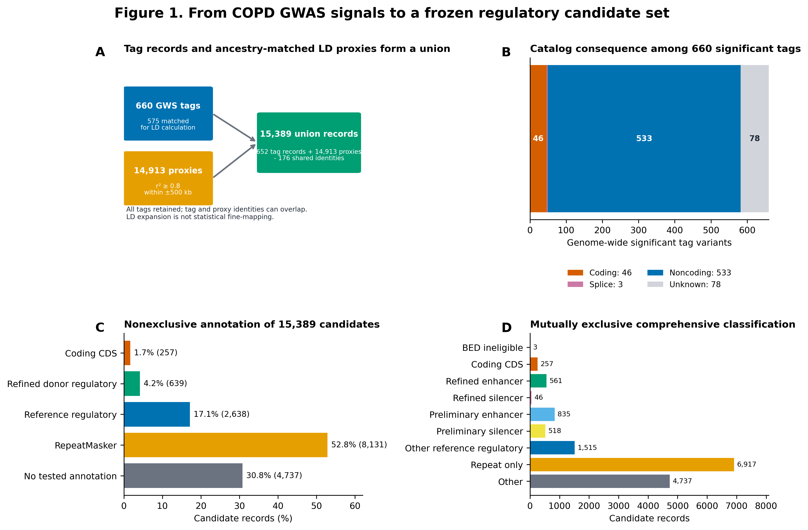
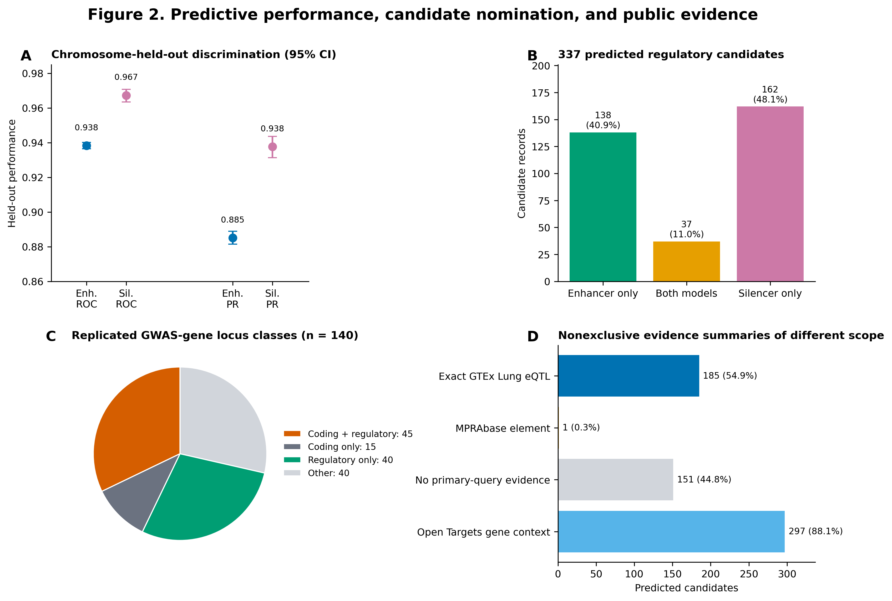
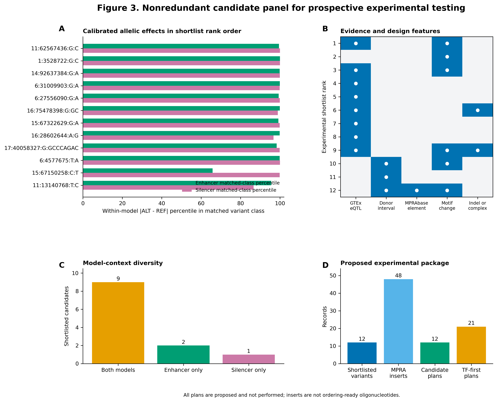

# Integrative regulatory genomics of chronic obstructive pulmonary disease susceptibility loci nominates variants for experimental testing

**Authors:** Author names were not provided.

**Affiliations:** Author affiliations were not provided.

**Corresponding author:** A corresponding author and contact details were not provided.

**Running title:** Regulatory genomics of COPD susceptibility loci

## Abstract

Most common-variant associations with chronic obstructive pulmonary disease (COPD) do not identify a causal nucleotide, regulatory element, target gene, or cell context. We integrated COPD genome-wide association study (GWAS) evidence with lung regulatory annotations, sequence models, public molecular associations, and a prospective experimental design. Genome-wide significant tags were expanded using ancestry-matched 1000 Genomes Phase 3 linkage disequilibrium (LD; r² ≥ 0.8 within ±500 kb), which was treated as candidate expansion and not fine-mapping. Candidate annotations included one Encyclopedia of DNA Elements (ENCODE) donor with severe emphysema, public regulatory catalogs, and published COPD expression and perturbation studies. Enhancer and silencer TREDNet models were fine-tuned on three-lobe bulk-lung chromatin profiles from that donor. A predicted regulatory candidate had a region score at or above the held-out 5% false-positive-rate threshold and an absolute allelic score difference at or above the 95th percentile of its matched variant class. Exact Genotype-Tissue Expression (GTEx) v10 Lung expression quantitative trait locus (eQTL) and massively parallel reporter assay database (MPRAbase) queries provided external context. Among 660 genome-wide significant tag identifiers, 582 had a Catalog consequence annotation and 533 of 582 (91.58%) were noncoding. The frozen set comprised 15,389 records: 652 tag records and 14,913 unique LD-proxy records, with 176 records serving both roles. Only 639 candidates (4.15%) overlapped a refined accessible enhancer or silencer interval from the severe-emphysema donor, whereas 2,638 (17.14%) overlapped SCREEN, Ensembl, or FANTOM5 regulatory annotations. Held-out receiver operating characteristic area under the curve (ROC AUC) was 0.9383 for the enhancer model and 0.9672 for the silencer model. Joint region and allelic criteria nominated 337 candidates, including 37 called by both models, 15 overlapping coding sequence, and 85 of 140 replicated GWAS-gene loci containing at least one candidate. Exact GTEx Lung significant cis-eQTL evidence occurred for 185 of 337 candidates, but these associations were not colocalized with COPD GWAS signals. One candidate overlapped MPRAbase elements, without proof that both alleles were assayed. A diversity-preserving panel selected 12 candidates from 153 LD-redundancy components and generated 48 sequence-validated computational reporter-insert designs. No COPD GWAS-eQTL colocalization, conditional fine-mapping, participant-level biobank replication, or wet-laboratory experiment was performed. This analysis provides an auditable candidate and testing framework, but causal inference requires replicated cell-specific chromatin studies, colocalization, endogenous allele perturbation, and phenotype-linked validation.

**Keywords:** COPD; GWAS; enhancer; silencer; regulatory variant; linkage disequilibrium; deep learning; GTEx; MPRA; CRISPR

## Introduction

COPD is defined clinically by persistent respiratory symptoms and airflow obstruction, with post-bronchodilator spirometry central to diagnosis [1]. It remains a major source of morbidity and mortality. Global Burden of Disease 2021 estimates included 213.39 million prevalent cases and 3.72 million deaths, while the World Health Organization reported 3.4 million deaths in 2023 [2-3]. Prevalence estimates depend strongly on the spirometric definition: a 2019 analysis estimated 391.9 million affected adults aged 30 to 79 years using a fixed forced expiratory volume in 1 second to forced vital capacity ratio (FEV1/FVC) and 292.0 million using the lower limit of normal [4]. This clinical heterogeneity extends to trajectories of lung growth and decline, emphysema, airway disease, inflammatory endotypes, smoking exposure, and comorbidity.

Genetic susceptibility is substantial but definition-dependent. A nationwide twin study estimated 47% heritability for a clinical COPD definition, with a wide confidence interval, while single-nucleotide polymorphism (SNP)-based estimates in smoking cohorts and population biobanks are lower and depend on phenotype scale [5-6]. Large genome-wide association studies (GWAS) have identified dozens of loci, including an 82-locus case-control analysis, and multi-ancestry lung-function studies have further refined respiratory-trait associations [7-8]. Lung function, radiographic emphysema, smoking behavior, and COPD case-control status are related but not interchangeable phenotypes. A lung-function association or an emphysema association was therefore not automatically treated as COPD case-control evidence in this study.

The interpretive challenge is predominantly regulatory. COPD-associated variants often lie outside coding exons, and LD couples a lead variant to many correlated candidates. Lung regulatory activity is also compartment-specific: small-airway epithelial, alveolar epithelial, endothelial, fibroblast, macrophage, and other immune-cell programs differ, while bulk lung reflects both cell-intrinsic expression and changing cellular composition. Single-cell studies have clarified cellular states and abundance shifts in COPD [9-10], and chromatin profiling of non-diseased primary lung cells has placed fine-mapped respiratory variants in cell-specific open chromatin [11]. These resources do not by themselves identify the disease-causal nucleotide or its target gene.

We therefore performed a staged analysis of COPD susceptibility loci. We harmonized GWAS evidence, expanded resolvable tags using ancestry-matched LD, annotated candidates with one matched severe-emphysema lung donor and public regulatory catalogs, fine-tuned enhancer and silencer sequence models, and separated predictions from published perturbation evidence. Exact public GTEx and MPRAbase queries were used as molecular context rather than causal validation. Finally, we converted the unchanged computational ranking into a nonredundant, prospective experimental panel. Throughout, we distinguished COPD from lung-function and emphysema evidence, LD expansion from statistical fine-mapping, bulk composition from cell-intrinsic expression, region perturbation from allele perturbation, and provisional target hypotheses from experimentally supported target links.

## Results

### COPD GWAS evidence produced a broad, predominantly noncoding candidate space

The frozen GWAS Catalog inventory contained 104 core COPD study accessions from 42 publications. Forty-five accessions had association rows and 69 provided full summary statistics. The association table contained 995 rows corresponding to 760 normalized unique tag variants; 827 rows met P ≤ 5 × 10⁻⁸ and collapsed to 660 unique genome-wide significant tag identifiers. Catalog mappings named 588 genes. Of these, 143 names appeared in at least two accessions, 117 appeared in at least two publications, and 140 of the 143 repeated names resolved unambiguously to GENCODE genes. Repetition of a Catalog mapping was treated as replicated mapping evidence, not as proof of an independent causal locus or gene.

Catalog consequence annotations were available for 582 of the 660 significant tags. Among annotated tags, 46 were coding, three were splice-associated, and 533 were noncoding; thus, 91.58% were noncoding. Seventy-eight significant tags had no Catalog consequence annotation. Ancestry-aware matching assigned tags to 1,245 reference-panel contexts. Of 660 significant tags, 575 matched the local GRCh38 1000 Genomes reference under prespecified coordinate and allele rules, including 539 exact coordinate-and-allele matches, seven unique-coordinate matches without reported alleles, and 29 adjacent indel-anchor matches. Eighty-five tags were unresolved and retained in the candidate audit rather than discarded [12-14].

Across the African (AFR), admixed American (AMR), East Asian (EAS), European (EUR), and South Asian (SAS) panels, 1,108 matched tag-panel assignments were polymorphic and 24 were monomorphic. LD expansion produced 33,378 tag-specific nonself links and 14,913 unique proxy records, including 13,403 single-nucleotide variants (SNVs) and 1,510 indel or complex records. Because multiple tag identifiers can collapse to one reference record and a record can be both a tag and a proxy, the frozen union contained 15,389 records: 652 tag records plus 14,913 proxy records minus 176 records with both roles. All tags, including unresolved tags, remained in the union. LD was defined as r² ≥ 0.8 within ±500 kb and was not interpreted as statistical fine-mapping, a credible set, or proof that every shared-tag component is mutually correlated in every ancestry (Figure 1A).

Replicated GWAS-gene loci were structurally nonrandom. The 140 replicated genes and their ±100-kb operational loci were longer than matched gene-type backgrounds at the minimum attainable empirical P value of 1/100,001. Chromosomal clustering was globally significant at the same permutation resolution, with chromosome 6 showing 27 observed versus 7.495 expected genes, a 3.60-fold ratio and Benjamini-Hochberg q = 0.000240. No gene-body conservation comparison remained significant after multiple-testing correction. Open Targets contained at least one non-COPD disease association for 125 of 140 genes, illustrating pleiotropic gene context rather than COPD-specific causality.

**Figure 1. From COPD GWAS signals to a frozen regulatory candidate set.** (A) The 660 significant tag identifiers, of which 575 were reference-matched for LD calculation, and 14,913 unique proxy records contributed to a 15,389-record union. The union equation uses reference-record identities: 652 tag records plus 14,913 proxy records minus 176 records with both roles. All tags were retained. LD expansion was not statistical fine-mapping. (B) Catalog consequence categories for 660 significant tags. (C) Selected nonexclusive annotations across all candidate records. Percentages can overlap. The severe-emphysema donor category requires accessibility plus H3K27ac or H3K27me3, whereas reference regulatory annotations combine SCREEN, Ensembl, and FANTOM5. (D) Mutually exclusive comprehensive classification. Plotted values and source paths are in `figure_data/figure_1_source_data.tsv`.

### Regulatory annotations were common, but matched donor overlap was limited

We standardized SCREEN Registry V3, Ensembl Regulatory Build 116, FANTOM5 enhancers, RepeatMasker, the ENCODE blacklist, and GENCODE v50 on GRCh38 [15-20]. Three candidate records lacked a valid genomic interval, leaving 15,386 BED-eligible records. Across the complete candidate set, 257 records (1.67%) overlapped a coding sequence, 1,956 (12.71%) overlapped a preliminary donor enhancer or silencer definition, 639 (4.15%) overlapped a refined donor interval, 2,638 (17.14%) overlapped SCREEN, Ensembl, or FANTOM5 regulatory annotations, 8,131 (52.84%) overlapped RepeatMasker, and 21 (0.14%) overlapped the ENCODE blacklist. These categories are nonexclusive.

The donor-specific profiles came from ENCODE donor ENCDO520EJG, a 60-year-old man of reported European ancestry with severe emphysema [21]. Matched assay for transposase-accessible chromatin with sequencing (ATAC-seq), histone H3 lysine 27 acetylation (H3K27ac), and histone H3 lysine 27 trimethylation (H3K27me3) were available across three lung lobes. The union contained 77,164 preliminary H3K27ac intervals, 78,899 preliminary H3K27me3 intervals, 71,746 refined ATAC plus H3K27ac intervals, and 15,699 refined ATAC plus H3K27me3 intervals. Within the 140 replicated GWAS-gene operational loci, 132 contained a refined enhancer interval and 94 contained a refined silencer interval. These locus-level intervals do not imply that a GWAS variant is causal.

The donor is not a COPD case cohort. ENCODE did not report post-bronchodilator spirometry or an adjudicated COPD diagnosis, and the profiles are from bulk lung. Severe emphysema provides disease-relevant context but cannot separate COPD diagnosis, anatomic region, cell mixture, smoking exposure, treatment, comorbidity, or interindividual variability. H3K27me3 is a broad repressive mark and does not by itself demonstrate silencer function. Consequently, donor overlap was recorded as context and never as independent functional validation.

The comprehensive exclusive hierarchy assigned three records as interval-ineligible, 257 as coding, 561 as refined enhancer, 46 as refined silencer, 835 as preliminary enhancer, 518 as preliminary silencer, 1,515 as other known regulatory, 6,917 as repeat-only, and 4,737 as other. Tag records were more often coding than proxy records: 49 of 649 positionally eligible tag records (7.55%) versus 228 of 14,913 proxy records (1.53%). This contrast reflects the different ascertainment of reported lead variants and LD-expanded records and was not tested as an enrichment claim (Figure 1B-D).

### Published COPD regulatory evidence was strongest for a small set of endogenous or region-level perturbations

The literature synthesis yielded 12 traceable expression findings, 12 regulatory-element findings, and eight functional-variant evidence rows. Evidence was stratified by phenotype, tissue or cell type, and perturbation unit rather than pooled into a generic functional label. Large single-cell studies separated within-state transcription from changes in state abundance [9-10]. Advanced COPD with radiographic emphysema showed lower NUPR1 in alveolar type 2 (AT2) cells, altered endothelial signaling, and enrichment of metallothionein-high macrophages, but these findings should not be generalized to all COPD [22]. A smaller three-versus-three severe-COPD study localized changes to immune and ciliated epithelial compartments and supported altered IGFBP5 and QKI protein, with important age and smoking imbalance [23].

Airway brushing profiles were epithelial-enriched rather than pure-cell measurements. A 98-gene signature was jointly associated with COPD and spirometric impairment and tracked emphysema, while a distal-to-proximal epithelial program was explicitly smoking-dependent [24-25]. Bulk lung and bronchoalveolar lavage studies were composition-sensitive: EPAS1 was supported by multi-omic association, lower lung protein, and endothelial knockdown, whereas the original bulk signal could reflect endothelial abundance as well as within-cell regulation [26]; bronchoalveolar lavage methylation represented a mixed immune-cell signal [27]. In contrast, purified cultured fibroblasts retained methylation and expression differences, and COPD-derived differentiated airway epithelium retained lower TET1 and CDH1 with enhancer-D hypermethylation, supporting cell-intrinsic components in those models [28-30]. Compartment mattered for WNT signaling: reduced FZD4 and repair signaling were observed in alveolar epithelium, primarily in an emphysema-repair context, while increased canonical WNT activity in COPD bronchial epithelium promoted barrier and differentiation defects [31-32]. These directions describe different compartments rather than a single contradictory whole-lung program.

The highest-confidence reviewed nucleotide was rs2013701 at FAM13A, where massively parallel reporter assay (MPRA) and conventional reporter effects were followed by promoter contact and endogenous homology editing that altered FAM13A expression and cell proliferation [33]. At HHIP, a risk haplotype containing rs6537296-A and rs1542725-C reduced reporter activity, and rs1542725-C increased binding of the Sp3 repressor, but the endogenous alleles were not edited [34]. A separate distal HHIP T2 enhancer had promoter contact and a deletion effect on HHIP and local topology across bronchial and induced pluripotent stem cell-derived AT2 contexts; the study reported that T2 does not contain a COPD GWAS variant [35]. At rs35421223, allele-sensitive reporter activity and CRISPR interference (CRISPRi) of the variant-containing region supported RUVBL1 and RAB7A as region-responsive genes without proving that the endogenous nucleotide caused the change [36]. CRISPRi at regions containing rs1800469 and rs2241712 supported nearby expression effects, but these were shared lung-disease modifier regions and not alternate-allele tests [37] (Table 1).

**Table 1. Functionally studied variants retained with their causal boundary.**

| Variant or haplotype | Phenotype scope | Element and target | Strongest test | Interpretation |
|---|---|---|---|---|
| rs2013701 | COPD susceptibility | FAM13A intronic sequence to FAM13A | Endogenous G-to-T edit after allele-paired reporter and chromosome-conformation capture (3C) | Endogenous allele-specific evidence in bronchial epithelial cells [33] |
| rs7671167 | COPD susceptibility | FAM13A intronic regulatory sequence | Allele-paired MPRA and luciferase | Episomal allele effect; endogenous target not established [33] |
| rs1795739 | COPD susceptibility | FAM13A intronic sequence to FAM13A | Allele-paired reporter plus promoter contact | Allele-specific reporter and contact; no endogenous edit [33] |
| rs6537296-A plus rs1542725-C | Severe COPD susceptibility | Distal enhancer to HHIP | Risk versus nonrisk haplotype reporter | Haplotype reporter evidence; endogenous alleles not edited [34] |
| rs1542725-C | Severe COPD susceptibility | Distal enhancer to HHIP through Sp3 | Allele-specific binding and reporter | Mechanistic episomal evidence; no endogenous edit [34] |
| rs35421223 | COPD susceptibility | Open H3K27ac region to RUVBL1 and RAB7A | Allele-paired reporter plus region CRISPRi | Region-to-gene support does not prove the nucleotide [36] |
| rs1800469 | Shared asthma, cystic-fibrosis, and COPD modifier | Enhancer-like 19q13 region to TGFB1 | Region CRISPRi | Region function only; neither COPD-specific nor allele-specific [37] |
| rs2241712 | Shared asthma and COPD modifier | Intronic 19q13 region to TGFB1, B9D2, and TMEM91 | Region CRISPRi | Region function only; neither COPD-specific nor allele-specific [37] |

### Held-out sequence models nominated 337 candidate regulatory variants

Enhancer and silencer models were fine-tuned from a frozen TREDNet phase-I representation [38]. Positive 1-kb windows were centered on donor-union ATAC peaks that overlapped H3K27ac for the enhancer model or H3K27me3 for the silencer model. Training used chromosomes 1 to 6, 10 to 22, X, and Y; chromosome 7 was used for validation; and chromosomes 8 and 9 were held out for testing. Positives and filtered DNase I-hypersensitive-site (DHS) controls were sampled at an overall 1:2 ratio. The enhancer test set contained 16,103 positives and 34,903 controls, and the silencer test set contained 2,646 positives and 5,902 controls.

The enhancer model achieved receiver operating characteristic area under the curve (ROC AUC) 0.938272 (95% bootstrap confidence interval [CI] 0.936441 to 0.940014), precision-recall area under the curve (PR AUC) 0.885103 (0.881510 to 0.888851), Brier score 0.090628, and expected calibration error 0.018553. The silencer model achieved ROC AUC 0.967243 (0.963408 to 0.970706), PR AUC 0.937608 (0.931289 to 0.943635), Brier score 0.061341, and expected calibration error 0.011078. Confidence intervals used 500 stratified bootstrap replicates. Performance on held-out chromosomes reduces local sequence leakage, but it is not external validation in another donor, disease group, or assay.

Reference and alternate 2,001-bp sequences were validated and scored for 15,303 of 15,389 records (99.44%). Eighty-two records had unresolved alleles, three lacked coordinates, and one had an ambiguous alternate allele. At the model-specific 5% held-out false-positive-rate thresholds, 1,392 candidates were enhancer-positive and 1,140 were silencer-positive, with 1,830 in union. A candidate was nominated only if it also exceeded the 95th percentile of absolute REF-ALT score difference within the same broad allele class, calibrated separately for SNVs and indel or complex variants. This joint criterion yielded 175 enhancer candidates and 199 silencer candidates, with 37 called by both models and 337 in union (Figure 2A-B).

The 337 candidates comprised 297 SNVs and 40 indel or complex variants, 21 tag records and 324 proxy records, with tag and proxy roles overlapping. There were 138 enhancer-only, 162 silencer-only, and 37 both-model calls. Fifteen candidates overlapped a GENCODE coding sequence, 50 overlapped a refined donor enhancer or silencer, 216 overlapped a SCREEN, Ensembl, or FANTOM5 annotation, and 220 overlapped either a donor-refined or public regulatory annotation. The 15 coding-overlap candidates may act through coding, regulatory, or dual mechanisms. A sequence-model call is therefore not an exclusive regulatory explanation.

Among 140 replicated GWAS-gene loci, 85 (60.71%) contained at least one predicted candidate. The mutually exclusive locus classes were 45 coding plus predicted regulatory, 15 coding only, 40 predicted regulatory only, and 40 other. Six loci (4.29%) lacked both an observed regulatory annotation and a 5%-threshold model prediction; this six-locus group is narrower than the 40-locus other class (Figure 2C).

**Figure 2. Predictive performance, candidate nomination, and public evidence.** (A) Point estimates and 95% stratified-bootstrap confidence intervals for held-out ROC and PR AUC. A point-range display avoids implying a zero baseline. (B) Model-context composition of 337 nominated candidates. (C) Mutually exclusive classes for 140 replicated GWAS-gene loci. (D) Public-resource summaries have different scopes and are not a partition. GTEx is exact variant-level molecular association, MPRAbase is regional element coverage, and Open Targets is nonexclusive gene-level context. Absence from the primary queries is not evidence against causality. Plotted values and source paths are in `figure_data/figure_2_source_data.tsv`.

### Motif, population, and target annotations refined hypotheses without establishing mechanism

DeepExplainer attribution and transcription factor motif discovery from importance scores (TF-MoDISco) were applied to 1,000 positive sequences per model [39-41]. Five enhancer patterns and four silencer patterns were retained. Six of 15 enhancer-pattern JASPAR 2024 matches and all 12 silencer-pattern matches passed q ≤ 0.05 [42]. Significant enhancer matches included EHF, ELF3, IKZF3, BATF::JUN, BATF3, and BATF motifs. Significant silencer matches included CTCF-family, PATZ1, KLF12, KLF16, SPIB, SPI1, ERG, FOS::JUN, FOSL2, and FOSL2::JUN motifs. These names denote transcription factor (TF) motif similarity, often at family resolution, and not measured occupancy.

Among 175 enhancer candidates, 49 contained a compatible motif site and 38 disrupted or created at least one such site. Among 199 silencer candidates, 144 contained a compatible site and 103 disrupted or created one. Motif occurrence was also widespread outside model-positive regions: 7,151 of 13,559 candidates outside either 5%-threshold region call contained at least one significant-model motif. Motif occurrence alone was therefore insufficient evidence for a regulatory element or TF mechanism.

All 337 candidates had exact 1000 Genomes superpopulation alternate-allele frequencies. There were 323 common, 11 low-frequency, and three rare variants under prespecified maximum-superpopulation frequency thresholds. None met the strict definition of frequency ≥0.01 in exactly one superpopulation and <0.001 in each of the other four. An ancestral allele could be mapped to REF or ALT for 310 candidates; 71 of 310 had global derived-allele frequency >0.5 and 131 exceeded 0.5 in at least one superpopulation. Frequency and ancestral-state summaries were descriptive and did not establish selection, risk direction, or disease mechanism [14,43].

GENCODE proximity, linked GWAS Catalog mapped genes, selected-locus membership, and direct coding-sequence (CDS) overlap generated 4,779 candidate-gene-method rows covering 337 candidates and 1,635 distinct gene labels [12,20]. Every candidate received nearest-any-gene and nearest-protein-coding transcription-start-site (TSS) hypotheses, plus all TSSs within 100 kb when present. No matched severe-emphysema donor regulatory-element-to-gene (rE2G), HiChIP, or equivalent chromatin-contact map was available. These assignments are provisional hypotheses, not proven targets.

Comparison with eight functionally studied rsIDs found two exact identities in the frozen candidate set. The endogenous-edited FAM13A variant rs2013701 was recovered as predicted enhancer candidate 4:88963935:G:T at priority rank 210. The reporter-tested rs7671167 was scorable but below both model region thresholds. The other six rsIDs were not exact identities in the resolved candidate set, so their recovery was not estimable rather than negative. One of 337 predicted candidates therefore had exact prior functional evidence at a studied rsID.

### Public validation provided molecular context but no causal replication

Exact GTEx v10 Lung matching required identical GRCh38 chromosome, position, reference allele (REF), and alternate allele (ALT) [44]. Of 337 candidates, 185 (54.90%) matched at least one significant bulk-lung cis-expression quantitative trait locus (cis-eQTL) pair. Seventy-two had a significant eGene that also matched a HUGO Gene Nomenclature Committee (HGNC)-resolved GWAS mapped gene or selected locus, and 144 of the 185 GTEx-supported candidates had an eGene present in the broad provisional target set [45]. No COPD GWAS-eQTL colocalization or conditional analysis was performed. Thus, the 185 exact matches are molecular associations from predominantly non-diseased bulk lung; they neither show that a shared causal variant drives COPD and expression nor identify a causal lung cell type.

MPRAbase v4.9.3 matching required unique GRCh38-to-hg19 conversion and exact reverse liftOver [46-47]. One candidate, 11:13140768:T:C (rs11022677), was covered by two elements in the Klein_MPRA_HepG2 dataset. No candidate rsID was found exactly in matched element metadata. Coordinate containment shows that an assayed sequence covered the base; it does not show that both candidate alleles were tested, and HepG2 is not a COPD lung-cell model. GTEx and MPRAbase evidence did not overlap: 186 candidates had either exact GTEx evidence or MPRAbase regional coverage, while 151 had neither. This absence category reflects incomplete tissue, cell-state, disease, allele, and assay coverage and is not a negative causal call.

At least one HGNC-resolved candidate-linked gene had an exact Open Targets COPD association for 297 candidates (88.13%) [45,48]. The tested gene universe included broad proximity hypotheses, so this is descriptive gene context and not variant-level support or enrichment. No framework-named biobank had local participant-level exact-candidate COPD statistics. Controlled-access and unavailable summary data were recorded as validation gaps rather than null replications (Figure 2D).

### A nonredundant 12-candidate panel supports prospective, not completed, experiments

The 337 ranked candidates formed 153 LD-redundancy components by transitive sharing of linked GWAS tags or source focal tags. At most one candidate was selected per component. Diversity anchors ensured representation of model context, variant class, refined severe-emphysema-donor overlap, exact GTEx Lung eQTL evidence, MPRAbase regional coverage, and predicted motif creation or disruption, after which the unchanged computational rank filled remaining slots. This procedure did not create a new composite score.

The final panel contained nine both-model candidates, two enhancer-only candidates, and one silencer-only candidate; two were indel or complex variants. Three overlapped a refined interval from the severe-emphysema donor, eight had an exact GTEx Lung significant eQTL, one had MPRAbase regional coverage, and seven had a GTEx eGene also present in the provisional target set. Table 2 lists exact coordinates, model context, and the target label used for prospective readout planning. Those target labels remain provisional until endogenous perturbation supports a region-to-gene link.

**Table 2. Prospective experimental panel.**

| Panel rank | Computational priority rank | GRCh38 candidate | Model context | Class | Exact-concordant or nearest protein-coding target label | Exact GTEx Lung eQTL | Selection emphasis |
|---:|---:|---|---|---|---|---|---|
| 1 | 1 | 11:62567436:G:C | Both | SNV | EEF1G; EML3; INTS5; ROM1 | Yes | Both-model prediction |
| 2 | 2 | 1:3528722:G:C | Both | SNV | ARHGEF16 | No | Rank fill after diversity anchors |
| 3 | 3 | 14:92637384:G:A | Both | SNV | RIN3 | Yes | Rank fill after diversity anchors |
| 4 | 4 | 6:31009903:G:A | Both | SNV | HCG22; SFTA2; VARS2 | Yes | Rank fill after diversity anchors |
| 5 | 5 | 6:27556090:G:A | Both | SNV | ZNF184 | Yes | Rank fill after diversity anchors |
| 6 | 6 | 16:75478398:G:GC | Both | Indel or complex | ENSG00000261783 | Yes | Indel or complex diversity |
| 7 | 7 | 15:67322629:G:A | Both | SNV | AAGAB; IQCH | Yes | Rank fill after diversity anchors |
| 8 | 8 | 16:28602644:A:G | Both | SNV | CDC37P1; EIF3C; SULT1A1 | Yes | Rank fill after diversity anchors |
| 9 | 9 | 17:40058327:G:GCCCAGAC | Both | Indel or complex | ORMDL3 | Yes | Rank fill after diversity anchors |
| 10 | 38 | 6:4577675:T:A | Enhancer only | SNV | CDYL | No | Enhancer-only diversity |
| 11 | 39 | 15:67150258:C:T | Silencer only | SNV | SMAD3 | No | Silencer-only diversity |
| 12 | 77 | 11:13140768:T:C | Enhancer only | SNV | RASSF10 | No | MPRAbase regional coverage |

The sequence package contains 48 computational insert designs: REF and ALT versions in forward and reverse-complement orientation for each candidate. Each forward design contains 100 GRCh38 genomic bases on each side of the normalized allele. There are 44 designs of 201 bp, two of 202 bp, and two of 208 bp; four carry sequence-review flags for guanine-cytosine (GC) content, homopolymers, or common Type IIS recognition sites. Each design isolates the nominated allele in reference-sequence flanks and does not reconstruct a phased local donor haplotype or nearby linked alleles. Relevant phased haplotypes should be tested when prior evidence or local biology warrants it.

The inserts are not ordering-ready oligonucleotides. Vector, promoter, adapters, barcodes, cloning sites, randomization, restriction-site remediation, and assay-specific controls require receiving-laboratory decisions. Proposed stages are allelic MPRA, endogenous-region CRISPRi, compatible base editing or prime editing, target-gene measurement, and TF binding and perturbation. Primary proposed contexts are donor-derived airway epithelium, primary or induced pluripotent stem cell-derived AT2 cells, and low-passage parenchymal lung fibroblasts. All 12 candidate plans and all 21 TF plans are explicitly labeled proposed and not performed. No experimental result or causal proof is claimed (Figure 3).

**Figure 3. Nonredundant candidate panel for prospective experimental testing.** (A) Within-model absolute allele-difference percentiles calibrated in the matched SNV or indel class. Enhancer and silencer values are ranks within separately trained models, not posterior probabilities or directly comparable raw effect sizes. Nomination separately required the corresponding region score to be at or above the model's held-out 5% false-positive-rate threshold, so a high allele-difference percentile alone is insufficient and model context reflects the joint region-plus-delta rule. (B) Binary evidence and design features. A filled cell denotes the stated feature, not causal validation. (C) Model-context composition. (D) Counts of variants, paired-allele and paired-orientation inserts, candidate plans, and TF-first plans. All plans are proposed and not performed; inserts are not ordering-ready oligonucleotides. Plotted values and source paths are in `figure_data/figure_3_shortlist_source_data.tsv` and `figure_data/figure_3_design_counts.tsv`.

## Discussion

This study provides an auditable bridge from COPD GWAS associations to prospective regulatory experiments. Its central contribution is not a claim that 337 variants are causal. Rather, it applies explicit and reproducible filters to a 15,389-record tag-plus-proxy union, preserves the origin of every candidate, quantifies the limits of each evidence type, and identifies a tractable panel that can falsify model predictions. The nominated set spans enhancer and silencer contexts, SNVs and indels, public molecular associations, and candidates without existing public support. This diversity is valuable because COPD biology is not confined to one lung compartment or one regulatory mechanism.

The results reinforce the regulatory character of common COPD susceptibility while also showing why a binary coding-versus-regulatory narrative is inadequate. More than 91% of consequence-annotated significant tags were noncoding, yet 15 of 337 nominated candidates overlap coding sequence. Those 15 may have coding, regulatory, or dual effects. Similarly, overlap with an enhancer catalog or a model-positive region is contextual evidence, not a causal assignment. The strongest reviewed evidence remained limited to a few mechanistic chains, especially endogenous editing of rs2013701 at FAM13A, allele-sensitive reporter and binding evidence at the HHIP risk haplotype, region deletion at the non-variant HHIP T2 enhancer, and region CRISPRi around rs35421223 [33-37]. This hierarchy illustrates the difference between a nucleotide perturbation, a region perturbation, reporter activity, chromatin contact, and observational association.

The cell-context synthesis also argues against a universal COPD regulatory program. Alveolar WNT repair impairment and bronchial WNT activation can coexist because they arise in different compartments and experimental models [31-32]. Bulk lung and bronchoalveolar lavage signals can reflect cellular composition as well as cell-intrinsic expression, whereas purified fibroblasts, differentiated epithelial cultures, and single-cell measurements offer different forms of resolution [22-30]. Even single-cell studies require separation of within-state expression from state abundance. Experimental follow-up should therefore pre-screen chromatin accessibility and target expression in airway epithelial, AT2, and fibroblast contexts rather than assuming that one cell model generalizes across COPD.

The model performance was strong on held-out chromosomes, and the scoring rule combined region-level classification with an allele-difference extreme within the matched variant class. These design choices reduce local sequence leakage and prevent SNVs from being calibrated directly against indels. They do not establish transportability across donors, COPD phenotypes, ancestries, cell types, exposures, or assays. Both models were trained using chromatin from a single bulk-lung donor with reported severe emphysema. The donor had no reported post-bronchodilator spirometry or clinically adjudicated COPD diagnosis. Severe emphysema is relevant to COPD biology, but it is not equivalent to a COPD case-control contrast. A one-donor model may learn anatomic and cell-composition features specific to that specimen.

Several additional limitations constrain causal interpretation. First, LD expansion at r² ≥ 0.8 was used to recover correlated candidates and is not fine-mapping. No Bayesian credible set, conditional association model, or ancestry-specific causal posterior was calculated. The 153 shared-tag components used for experimental diversity are redundancy heuristics, not formal LD blocks. Second, no COPD GWAS-eQTL colocalization was performed. The 185 exact GTEx Lung cis-eQTL matches show that the same allele is associated with expression in predominantly non-diseased bulk lung, but they do not show that COPD risk and expression share a causal variant. Third, target assignments were broad. Nearest genes, genes within 100 kb, propagated Catalog mappings, and selected-locus membership generated 1,635 distinct labels, and no matched donor contact map was available. The apparently high Open Targets coverage is expected in such a broad gene universe and is not independent variant evidence.

Fourth, public functional validation was sparse and context-limited. One candidate had MPRAbase regional coverage, in HepG2, with no demonstration that both candidate alleles were assayed. MPRAbase absence does not mean lack of regulatory activity. The prospective reporter constructs use GRCh38 reference flanks and isolate one nominated allele; they do not reproduce phased local haplotypes, which can matter for enhancer output. Fifth, no participant-level COPD biobank analysis was available. Controlled-access or unavailable exact-candidate statistics were treated as missing validation, not negative replication. Sixth, motif matches and allele-specific position-weight-matrix (PWM) changes are sequence hypotheses. The fact that thousands of candidates outside model-positive regions contain compatible motifs demonstrates that motif occurrence cannot substitute for chromatin or occupancy assays.

The experimental panel is deliberately prospective. Allelic MPRA can test sequence-dependent reporter output, but episomal activity does not establish endogenous regulation. CRISPRi can test an endogenous region, but it cannot identify the causal nucleotide. Genotype-verified base or prime editing, replicated molecular consequences, and appropriate off-target and clone controls offer stronger nucleotide-level evidence. A target claim further requires a reproducible expression or chromatin consequence after endogenous perturbation. TF claims require allele-paired binding, occupancy in a relevant context, TF perturbation with independent reagents and rescue, and ideally an allele-by-TF interaction. None of these experiments has yet been performed for the 12-candidate panel.

Future work should begin with multi-donor, phenotype-resolved chromatin data from adjudicated COPD cases and smoking-matched controls, including airway, alveolar, fibroblast, endothelial, and immune compartments. Statistical fine-mapping should integrate multi-ancestry association data, and colocalization should compare COPD GWAS with cell-resolved expression quantitative trait locus (eQTL) or chromatin-accessibility quantitative trait locus (caQTL) signals. Contact-informed target mapping should precede or accompany endogenous perturbation. Reporter assays should include phased haplotypes where local evidence warrants them. Finally, phenotype-linked validation in participant-level cohorts is required before any clinical inference. Within these boundaries, the present candidate list and experimental package provide a transparent starting point rather than a causal endpoint.

## Methods

### Study design and evidence boundary

We integrated public disease, genetic, regulatory, sequence-modeling, expression, and assay resources available by 1 October 2026. Analyses used GRCh38 unless a database required conversion. Evidence classes were kept separate: association, physical overlap, sequence prediction, molecular QTL association, reporter coverage, region perturbation, and endogenous allele perturbation were not collapsed. The study generated no new participant data and performed no wet-laboratory experiment.

COPD was interpreted according to the GOLD clinical framework, with post-bronchodilator airflow obstruction central to diagnosis [1]. COPD case-control evidence, lung-function evidence, radiographic emphysema evidence, smoking-dependent evidence, and shared lung-disease modifier evidence were recorded as distinct phenotype scopes. For expression studies, within-cell-state differential expression was distinguished from shifts in cell abundance and from bulk or mixed-cell composition.

### GWAS acquisition and harmonization

The NHGRI-EBI GWAS Catalog associations, studies, and ancestry tables were frozen from the 15 September 2026 release [12]. COPD scope was defined using MONDO:0005002 and the legacy equivalent EFO:0000341, followed by manual phenotype review [13]. Association coordinates, variant identifiers, P values, reported alleles, mapped genes, study accessions, publications, ancestry descriptors, sample sizes, and available consequence annotations were retained. Genome-wide significance was P ≤ 5 × 10⁻⁸.

Variant identifiers and coordinates were normalized without imputing missing reported alleles. Unique tags were reported both as Catalog identifiers and as collapsed reference records. Mapped-gene repetition was summarized across accessions and publications. A gene name observed in at least two accessions entered the repeated-mapping set; unambiguous names were resolved against GENCODE v50 [20]. This rule operationalized repeated Catalog mapping and was not a locus-level replication or causal-gene criterion.

### Ancestry-aware LD expansion

LD used locally frozen, phased, biallelic SNV and indel variant call format (VCF) files from the 1000 Genomes Phase 3 GRCh38 remap dated 12 March 2019 [14]. GWAS ancestry metadata selected one or more AFR, AMR, EAS, EUR, or SAS panels. The effective sample counts were 660 AFR, 347 AMR, 504 EAS, 503 EUR, and 489 SAS; one AFR metadata sample was absent from the frozen VCFs. Tag-reference matching was audited as exact coordinate and allele, unique coordinate without a reported allele, or unique adjacent indel-anchor match. Unresolved tags were retained but not LD-expanded. Monomorphic tag-panel assignments were also retained in the audit.

For polymorphic assignments, bcftools 1.23 prepared population subsets and PLINK v1.90b4.4 calculated genotype-count LD with `--r2 --ld-window-kb 500 --ld-window 999999 --ld-window-r2 0.8`; the phased input did not imply use of a phased-haplotype estimator. Focal self-pairs were excluded. Proxy identities were collapsed across focal tags and panels, while tag-specific links and panel provenance were preserved. The candidate union retained all tag records and all unique proxy records; records could have both roles. This was candidate expansion, not fine-mapping. No conditional model, credible set, or posterior causal probability was calculated.

### Gene-locus comparisons

The primary gene set comprised 140 unambiguous repeated GWAS-mapped genes. Operational loci were gene bodies with symmetric 100-kb flanks. Gene and locus lengths were compared with backgrounds sampled without replacement within exact GENCODE gene type, using 100,000 permutations and seed 20261001. Chromosome clustering used the same permutation count and Benjamini-Hochberg correction across chromosome tests. Mean phyloP and phastCons scores from the GRCh38 100-vertebrate tracks were summarized across gene bodies and tested against matched backgrounds [49]. Other-disease associations were extracted from exact Open Targets target-disease tables after excluding COPD itself, ontology ancestors and descendants, and case-insensitive labels containing COPD, chronic obstructive, emphysema, chronic bronchitis, or bronchiectasis [48].

### Regulatory resources and severe-emphysema donor definitions

Public regulatory intervals were standardized from SCREEN Registry V3, Ensembl Regulatory Build 116, FANTOM5 hg38 enhancers, UCSC RepeatMasker, and ENCODE blacklist v2 [15-19]. GENCODE v50 defined coding sequence and gene coordinates [20]. Analyses retained canonical chromosomes and used 0-based half-open intervals for overlap operations; overlaps were calculated with bedtools 2.31.1 and independently reconciled against scripted interval counts.

Donor-specific chromatin was obtained from released ENCODE records for ENCDO520EJG [21]. The biosample was bulk lung from a 60-year-old man of reported European ancestry with severe emphysema. No post-bronchodilator spirometry or adjudicated COPD diagnosis was available. Preliminary enhancer intervals were the three-lobe union of H3K27ac peaks, and preliminary silencer intervals were the union of H3K27me3 peaks. Refined enhancers required overlap between donor ATAC and H3K27ac; refined silencers required overlap between donor ATAC and H3K27me3. These definitions identify chromatin contexts and do not prove enhancer or silencer activity.

Candidate annotations were reported nonexclusively and under prespecified exclusive hierarchies. The comprehensive hierarchy prioritized interval ineligibility, coding sequence, refined enhancer, refined silencer, preliminary enhancer, preliminary silencer, other public regulatory annotation, repeat-only, and other. ENCODE blacklist overlap was retained as a separate exclusion flag.

### Literature evidence synthesis

We performed targeted, non-systematic evidence searches on 1 October 2026 in PubMed, PubMed Central, Crossref, official resource sites, and publisher pages. The 12 disease-background queries and selection rules are recorded verbatim in the Supplementary Data S1 search log; the 18 regulatory-literature query strings and one existing-source route are recorded in the Supplementary Data S4 search log. Studies were selected and abstracted in a single-pass workflow; there was no protocol registration, independent duplicate screening, comprehensive systematic-search claim, or formal risk-of-bias assessment. Three previously verified single-cell and chromatin sources were reused from the source register. Studies were abstracted by phenotype scope, tissue or cell type, element type, target gene, assay, tested unit, and causal strength. Single-cell within-state expression was kept separate from abundance changes; bulk lung, airway brushing, and bronchoalveolar lavage were marked as composition-sensitive. COPD, lung-function, smoking-dependent, advanced-emphysema, and shared lung-disease evidence were not interchanged.

The evidence scale ranked endogenous alternate-allele perturbation above endogenous region deletion or CRISPRi, followed by allele-specific reporter or binding assays, and then observational accessibility, methylation, expression, contact, QTL, or sequence-model evidence. Region perturbation supported the region and measured target but not necessarily a nearby nucleotide. Alternate alleles had to be directly compared for an allele-function designation [22-37].

### Enhancer and silencer model training

TREDNet v2 phase-II enhancer and silencer classifiers were fine-tuned from the same frozen phase-I sequence representation [38]. One-kilobase positive windows were centered on donor-union ATAC peaks overlapping H3K27ac for the enhancer model or H3K27me3 for the silencer model. Controls came from a reusable non-promoter, non-exon DHS pool after removal of the ENCODE blacklist, the model-matched histone peaks, and positive windows. Canonical chromosomes were retained. Seed 20261001 and an exact 1:2 positive-to-control ratio were used overall.

Training chromosomes were 1 to 6, 10 to 22, X, and Y; chromosome 7 was validation; and chromosomes 8 and 9 were test. Each model ran at most 50 epochs with deterministic TensorFlow operations, nominal batch size 256, binary cross-entropy, and Adadelta with learning rate 0.001, rho 0.95, and epsilon 1 × 10⁻⁷. Early stopping monitored validation loss with patience 15 and restored the lowest-loss weights. The selected enhancer checkpoint was epoch 42 and the silencer checkpoint was epoch 37. ROC AUC, trapezoidal PR AUC, average precision, Brier score, log loss, and 10-bin expected calibration error were calculated on the held-out chromosomes. Ninety-five percent intervals used 500 stratified bootstrap replicates that resampled positive and control examples separately. Score thresholds were fixed at nominal held-out false-positive rates of 10%, 5%, 3%, and 1%; the 5% thresholds were 0.643623 for the enhancer model and 0.585050 for the silencer model.

### Allele-specific sequence scoring and nomination

For every resolvable record, 2,001-bp variant-centered REF and ALT sequences were constructed against GRCh38. Reference alleles, centered edits, sequence lengths, and model inputs were audited. Each allele was scored by both models. For a given model, the region score was max(REF, ALT), and the allelic effect was ALT minus REF.

A nominated model-specific candidate required: successful sequence scoring, no ENCODE blacklist overlap, region score at or above the model's held-out 5% false-positive-rate threshold, and absolute allelic effect at or above the 95th percentile among eligible records in the same broad variant class. SNVs and indel or complex variants were calibrated separately. Absolute-difference thresholds were 0.0570632 for enhancer SNVs, 0.0493609 for enhancer indels, 0.0288026 for silencer SNVs, and 0.0261834 for silencer indels. Enhancer and silencer calls were unioned without treating scores from the separately trained models as directly comparable. The rank combined regulatory evidence tier, number of model calls, matched-class allelic percentile, region-threshold ratio, maximum tag-proxy r², and stable candidate identifier. The rank is a prioritization order, not a causal probability.

### Attribution and motif hypotheses

DeepExplainer feature attribution and TF-MoDISco were run on 1,000 positive sequences per model, using 100 control sequences as the attribution background [39-41]. Retained patterns were matched to JASPAR 2024 profiles, with q ≤ 0.05 defining significant motif similarity [42]. For candidate allele analysis, the best overlapping two-strand position-weight-matrix (PWM) score was scaled to the theoretical motif range. A compatible site required a relative score ≥0.8. Creation or disruption required an allele to cross that threshold. Motif similarity and PWM changes were treated as sequence hypotheses, not TF occupancy or binding measurements.

### Population and target-gene annotation

Exact alternate-allele frequencies were recalculated for the 337 candidates in AFR, AMR, EAS, EUR, and SAS 1000 Genomes superpopulations [14]. A variant was common if its maximum superpopulation alternate-allele frequency was ≥0.05, low-frequency if ≥0.01 and <0.05, and rare if <0.01. Strict population specificity required frequency ≥0.01 in exactly one superpopulation and <0.001 in all four others. Ensembl Variation endpoints supplied cached aliases and ancestral alleles [43]. Derived-allele summaries excluded unresolved ancestral states.

Target hypotheses combined nearest GENCODE TSS, nearest protein-coding TSS, all TSSs within 100 kb, GWAS Catalog mapped genes propagated through recorded tag-proxy links, selected-locus membership, and direct CDS overlap [12,20]. Each method was retained separately. No contact-informed assignment was made without a matched severe-emphysema donor contact map.

### Public molecular validation

GTEx Analysis Release V10 Lung significant cis-eQTL pairs were queried by exact GRCh38 chromosome, 1-based position, REF, and ALT [44]. Significant eGenes were compared with HGNC-approved symbols in mapped-gene, selected-locus, and provisional-target sets [45]. No COPD GWAS-eQTL colocalization, conditional analysis, or shared-causal-variant model was performed. GTEx Lung was interpreted as predominantly non-diseased bulk-tissue molecular association.

MPRAbase v4.9.3 was queried after converting one-base candidate intervals from GRCh38 to hg19 with UCSC liftOver [46-47]. A coordinate was eligible only if it mapped uniquely and returned to the original GRCh38 base by reverse conversion. Coordinate containment and exact candidate-rsID metadata were recorded separately. A covering element was not assumed to have tested both alleles. Raw activity scores were not compared across heterogeneous MPRA studies.

Candidate-linked genes were resolved against HGNC and queried for exact MONDO:0005002 associations in Open Targets [45,48]. Because the input gene set included broad proximity hypotheses, these results were described as gene context and were excluded from the variant-level validation union. Resource-access and biobank audits recorded missing or controlled-access candidate-level COPD statistics as gaps, not null findings.

### Experimental-panel selection and sequence design

Candidate redundancy components were formed by transitively joining records that shared a linked GWAS tag or source focal tag. This was a selection heuristic and not a statement that all component members had pairwise LD in all ancestries. At most one candidate was chosen per component. The unchanged model priority was preserved except when a unique diversity anchor was required to cover both-model, enhancer-only, silencer-only, indel or complex, refined-donor overlap, exact GTEx evidence, MPRAbase coverage, or motif-change strata. The sole departure from the next default rank was selection of priority rank 77 instead of rank 31 from the same redundancy component to represent the MPRAbase stratum. No new composite score was optimized.

For each of 12 candidates, forward REF and ALT inserts included exactly 100 GRCh38 reference bases on either side of the normalized allele. Reverse-complement versions were generated exactly, yielding four inserts per candidate. Allele identity, common flanks, lengths, centering, sequence alphabet, and reverse complements were checked. Designs isolate one allele in reference flanks and do not encode phased donor haplotypes or nearby linked alleles. Sequence flags identify high GC, homopolymers, or common Type IIS recognition sites. The sequences omit vector, promoter, adapters, barcodes, cloning sites, randomization, and assay controls and are not ordering-ready oligonucleotides.

Proposed follow-up included at least 10 independent barcodes per reporter construct and three biological replicates per selected context, subject to prospective power analysis. Endogenous testing proposed at least three non-overlapping CRISPRi guides, genotype-verified editing, off-target review, independent clones or clone-aware analysis, and rescue where applicable. Primary contexts were donor-derived airway epithelium, primary or induced pluripotent stem cell-derived AT2 cells, and low-passage parenchymal lung fibroblasts. Cell lines were limited to technical optimization. All designs were labeled proposed and not performed.

### Reproducibility and statistical analysis

All tests were two-sided unless the statistic was intrinsically one-sided. Genome-wide significance used P ≤ 5 × 10⁻⁸. Permutation tests used 100,000 replicates, giving a minimum empirical P of 1/100,001. Chromosome and conservation comparisons used Benjamini-Hochberg correction. Model confidence intervals used 500 stratified bootstrap replicates. No post hoc threshold was relaxed after reviewing known variants. Core analysis used Python 3.9.15, pandas 2.0.3, and NumPy 1.24.4. Model training used Python 3.13.0, TensorFlow 2.20.0, Keras 3.14.1, and NumPy 2.5.0. Attribution used Python 3.9.22, TensorFlow runtime 2.15.0 (distribution 2.15.0.post1), Keras 2.15.0, SHAP 0.47.1, and NumPy 1.26.4; motif processing used modisco 0.5.16.4.1 and modisco-lite 2.3.2. Coordinate conversion used UCSC tools build 503. Primary tables, model checkpoints, checksums, the software version-capture table, validation checks, plotted source data, and the script that generated all manuscript figures are retained with the analysis package. Attribution versions were captured after the run from its preserved configured interpreter. A complete package lockfile was not captured and should be added to a public release before independent environment reconstruction.

Roadmap adult lung and lung-fibroblast reference epigenomes were considered contextual resources but were not substituted for the matched ENCODE donor profiles [50].

## Supplementary Materials

The supplementary package is organized around immutable primary outputs rather than reformatted secondary tables. Paths below are relative to the COPD analysis root. The supplementary manifest records the size and SHA-256 checksum of every static file designated for the data and reproducibility bundle. The live whole-workflow validation table and log are distributed alongside, but intentionally excluded from that manifest because the audit rewrites them after checking the manifest and would otherwise create a checksum cycle.

- **Supplementary Data S1, disease background:** `01_background/results/epidemiology.tsv`, `heritability.tsv`, `genes_pathway_tissue.tsv`, `treatments.tsv`, and `cell_tissue_resources.tsv`, with exact queries in `01_background/data/search_log.tsv`.
- **Supplementary Data S2, GWAS inventory and candidate construction:** primary TSVs under `02_gwas/results/`, including study, ancestry, association, consequence, repeated-gene, LD-audit, locus, conservation, clustering, and other-disease outputs.
- **Supplementary Data S3, regulatory landscape:** donor/reference inventories, per-gene burden, nonexclusive and exclusive summaries, and the record-level classification table under `03_regulatory_landscape/results/`.
- **Supplementary Data S4, published evidence:** expression, regulatory-element, and functional-variant evidence tables, with the exact regulatory-literature queries in the supplied search log.
- **Supplementary Data S5, model training and nomination:** model-performance, threshold, partition, sequence-audit, allele-score, nomination, locus, population, target, motif, and literature-recovery outputs under `04_modeling/results/`, including the canonical ranked list.
- **Supplementary Data S6, public validation:** exact GTEx v10 Lung pair outputs, MPRAbase conversion and element audits, HGNC and Open Targets tables, access audits, and integrated candidate validation under `05_computational_validation/results/`.
- **Supplementary Data S7, prospective experimental design:** the candidate shortlist, selection audit, MPRA constructs, candidate plans, TF-first plans, cell-context controls, upstream checksums, and validation checks under `06_experimental_validation/results/`.
- **Supplementary Figure source data:** `figure_data/figure_1_source_data.tsv`, `figure_2_source_data.tsv`, `figure_3_shortlist_source_data.tsv`, and `figure_3_design_counts.tsv`.
- **Reproducible figure code:** `scripts/build_figures.py` generates every manuscript SVG and PNG directly from frozen primary outputs.
- **Traceability:** `result_to_manuscript_map.tsv` maps each quantitative or interpretive manuscript claim to its primary result file and manuscript location.

## References

1. Global Initiative for Chronic Obstructive Lung Disease. [Global Strategy for Prevention, Diagnosis and Management of COPD: 2026 Report](https://goldcopd.org/2026-gold-report-and-pocket-guide/). 2026.
2. Wang Z, et al. [Global, regional, and national burden of chronic obstructive pulmonary disease and its attributable risk factors from 1990 to 2021: an analysis for the Global Burden of Disease Study 2021](https://doi.org/10.1186/s12931-024-03051-2). Respir Res. 2025;26:2.
3. World Health Organization. [Chronic obstructive pulmonary disease (COPD)](https://www.who.int/news-room/fact-sheets/detail/chronic-obstructive-pulmonary-disease-(copd)). Updated 10 June 2026.
4. Adeloye D, et al. [Global, regional, and national prevalence of, and risk factors for, chronic obstructive pulmonary disease (COPD) in 2019: a systematic review and modelling analysis](https://doi.org/10.1016/S2213-2600(21)00511-7). Lancet Respir Med. 2022;10:447-458.
5. Meteran H, et al. [Genetic factors explain half of the individual susceptibility to chronic bronchitis, airflow obstruction and COPD regardless of the spirometric definition: a nationwide twin study](https://doi.org/10.1007/s00408-025-00825-3). Lung. 2025;203:70.
6. Zhou JJ, et al. [Heritability of chronic obstructive pulmonary disease and related phenotypes in smokers](https://doi.org/10.1164/rccm.201302-0263OC). Am J Respir Crit Care Med. 2013;188:941-947.
7. Sakornsakolpat P, et al. [Genetic landscape of chronic obstructive pulmonary disease identifies heterogeneous cell-type and phenotype associations](https://doi.org/10.1038/s41588-018-0342-2). Nat Genet. 2019;51:494-505.
8. Shrine N, et al. [Multi-ancestry genome-wide association analyses improve resolution of genes and pathways influencing lung function and chronic obstructive pulmonary disease risk](https://doi.org/10.1038/s41588-023-01314-0). Nat Genet. 2023;55:410-422.
9. Booth S, et al. [A single-cell atlas of small airway disease in chronic obstructive pulmonary disease: a cross-sectional study](https://doi.org/10.1164/rccm.202303-0534OC). Am J Respir Crit Care Med. 2023;208:472-486.
10. Zhang Y, et al. [Aberrant cellular communities underlying disease heterogeneity in chronic obstructive pulmonary disease](https://doi.org/10.1038/s41588-025-02480-z). Nat Genet. 2026;58:376-391.
11. Benway CJ, et al. [Chromatin Landscapes of Human Lung Cells Predict Potentially Functional Chronic Obstructive Pulmonary Disease Genome-Wide Association Study Variants](https://doi.org/10.1165/rcmb.2020-0475OC). Am J Respir Cell Mol Biol. 2021;65:92-102.
12. NHGRI-EBI GWAS Catalog. [Full associations, studies, and ancestries release dated 15 September 2026](https://ftp.ebi.ac.uk/pub/databases/gwas/releases/2026/09/). Accessed 21 September 2026.
13. Experimental Factor Ontology. [Version 3.92.0 release metadata and COPD term mapping](https://github.com/EBISPOT/efo/releases/tag/v3.92.0). Accessed 21 September 2026; no local full ontology snapshot retained.
14. 1000 Genomes Project Consortium. [A global reference for human genetic variation](https://doi.org/10.1038/nature15393). Nature. 2015;526:68-74.
15. ENCODE Project and Weng Laboratory. [SCREEN Registry of candidate cis-regulatory elements, Registry V3, GRCh38](https://downloads.wenglab.org/V3/GRCh38-cCREs.bed). Accessed 21 September 2026.
16. Ensembl. [Regulatory Build for Homo sapiens GRCh38, release 116](https://ftp.ensembl.org/pub/release-116/regulation/homo_sapiens/GRCh38/annotation/). Accessed 21 September 2026.
17. FANTOM Consortium. [FANTOM5 CAGE enhancer atlas, hg38_latest](https://fantom.gsc.riken.jp/5/datafiles/reprocessed/hg38_latest/extra/enhancer/). Accessed 21 September 2026.
18. UCSC Genome Browser. [RepeatMasker annotations for the GRCh38/hg38 assembly](https://hgdownload.soe.ucsc.edu/goldenPath/hg38/database/rmsk.txt.gz). Accessed 21 September 2026.
19. ENCODE Project and Boyle Laboratory. [ENCODE hg38 blacklist version 2](https://github.com/Boyle-Lab/Blacklist). Accessed 21 September 2026.
20. GENCODE Project. [GENCODE human release 50 comprehensive gene annotation for GRCh38](https://www.gencodegenes.org/human/release_50.html). Accessed 21 September 2026.
21. ENCODE Project. [Donor ENCDO520EJG and linked lung accessibility and histone-mark records](https://www.encodeproject.org/human-donors/ENCDO520EJG/). Accessed 1 October 2026; exact experiment and file accessions are supplied in the regulatory-landscape manifest.
22. Sauler M, et al. [Characterization of the COPD alveolar niche using single-cell RNA sequencing](https://doi.org/10.1038/s41467-022-28062-9). Nat Commun. 2022;13:494.
23. Li X, et al. [Single cell RNA sequencing identifies IGFBP5 and QKI as ciliated epithelial cell genes associated with severe COPD](https://doi.org/10.1186/s12931-021-01675-2). Respir Res. 2021;22:100.
24. Steiling K, et al. [A dynamic bronchial airway gene expression signature of chronic obstructive pulmonary disease and lung function impairment](https://doi.org/10.1164/rccm.201208-1449OC). Am J Respir Crit Care Med. 2013;187:933-942.
25. Yang J, et al. [Smoking-Dependent Distal-to-Proximal Repatterning of the Adult Human Small Airway Epithelium](https://doi.org/10.1164/rccm.201608-1672OC). Am J Respir Crit Care Med. 2017;196:340-352.
26. Yoo S, et al. [Integrative analysis of DNA methylation and gene expression data identifies EPAS1 as a key regulator of COPD](https://doi.org/10.1371/journal.pgen.1004898). PLoS Genet. 2015;11:e1004898.
27. Eriksson Strom J, et al. [Chronic Obstructive Pulmonary Disease Is Associated with Epigenome-Wide Differential Methylation in BAL Lung Cells](https://doi.org/10.1165/rcmb.2021-0403OC). Am J Respir Cell Mol Biol. 2022;66:638-647.
28. Yeung-Luk BH, et al. [Epigenetic Reprogramming Drives Epithelial Disruption in Chronic Obstructive Pulmonary Disease](https://doi.org/10.1165/rcmb.2023-0147OC). Am J Respir Cell Mol Biol. 2024;70:165-177.
29. Schwartz U, et al. [High-resolution transcriptomic and epigenetic profiling identifies novel regulators of COPD](https://doi.org/10.15252/embj.2022111272). EMBO J. 2023;42:e111272.
30. Vucic EA, et al. [DNA Methylation Is Globally Disrupted and Associated with Expression Changes in Chronic Obstructive Pulmonary Disease Small Airways](https://doi.org/10.1165/rcmb.2013-0304OC). Am J Respir Cell Mol Biol. 2014;50:912-922.
31. Skronska-Wasek W, et al. [Reduced Frizzled Receptor 4 Expression Prevents WNT/beta-Catenin-driven Alveolar Lung Repair in Chronic Obstructive Pulmonary Disease](https://doi.org/10.1164/rccm.201605-0904OC). Am J Respir Crit Care Med. 2017;196:172-185.
32. Carlier FM, et al. [Canonical WNT pathway is activated in the airway epithelium in chronic obstructive pulmonary disease](https://doi.org/10.1016/j.ebiom.2020.103034). EBioMedicine. 2020;61:103034.
33. Castaldi PJ, et al. [Identification of Functional Variants in the FAM13A Chronic Obstructive Pulmonary Disease Genome-Wide Association Study Locus by Massively Parallel Reporter Assays](https://doi.org/10.1164/rccm.201802-0337OC). Am J Respir Crit Care Med. 2019;199:52-61.
34. Zhou X, et al. [Identification of a chronic obstructive pulmonary disease genetic determinant that regulates HHIP](https://doi.org/10.1093/hmg/ddr569). Hum Mol Genet. 2012;21:1325-1335.
35. Guo F, et al. [Identification of a distal enhancer regulating hedgehog interacting protein gene in human lung epithelial cells](https://doi.org/10.1016/j.ebiom.2024.105026). EBioMedicine. 2024;101:105026.
36. Gong L, et al. [Interrogation of functional variants in COPD GWAS loci by massively parallel reporter assays](https://doi.org/10.1093/ajrcmb/aanag179). Am J Respir Cell Mol Biol. 2026;aanag179. Published online 15 September 2026. PMID 42745457.
37. Stuart WD, et al. [CRISPRi-mediated functional analysis of lung disease-associated loci at non-coding regions](https://doi.org/10.1093/nargab/lqaa036). NAR Genom Bioinform. 2020;2:lqaa036.
38. Hudaiberdiev S, et al. [Modeling islet enhancers using deep learning identifies candidate causal variants at loci associated with T2D and glycemic traits](https://doi.org/10.1073/pnas.2206612120). Proc Natl Acad Sci U S A. 2023;120:e2206612120. PMID 37603758.
39. Shrikumar A, et al. [Technical Note on Transcription Factor Motif Discovery from Importance Scores (TF-MoDISco), version 0.5.6.5](https://arxiv.org/abs/1811.00416). arXiv:1811.00416. 2018.
40. Schreiber J, Raine I. [tfmodisco-lite: a memory-efficient implementation of TF-MoDISco](https://github.com/jmschrei/tfmodisco-lite). Accessed 1 October 2026.
41. Lundberg SM, Lee SI. [A Unified Approach to Interpreting Model Predictions](https://proceedings.neurips.cc/paper_files/paper/2017/hash/8a20a8621978632d76c43dfd28b67767-Abstract.html). Advances in Neural Information Processing Systems 30. 2017:4765-4774.
42. Rauluseviciute I, et al. [JASPAR 2024: 20th anniversary of the open-access database of transcription factor binding profiles](https://doi.org/10.1093/nar/gkad1059). Nucleic Acids Res. 2024;52:D174-D182.
43. Ensembl. [REST API VEP and Variation endpoints for Homo sapiens](https://rest.ensembl.org/). Accessed 1 October 2026.
44. Genotype-Tissue Expression Project. [GTEx Analysis Release V10 single-tissue cis-eQTL data; dbGaP accession phs000424.v10.p2](https://gtexportal.org/home/datasets/). Accessed 1 October 2026.
45. HUGO Gene Nomenclature Committee. [HGNC complete approved-gene dataset](https://hgnc.genenames.org/download/). Accessed 1 October 2026.
46. Zhao J. [MPRAbase database, version 4.9.3](https://doi.org/10.5281/zenodo.10920747). Zenodo. 2024.
47. UCSC Genome Browser. [GRCh38-to-GRCh37 and GRCh37-to-GRCh38 liftOver chain files and liftOver software](https://hgdownload.gi.ucsc.edu/goldenpath/hg38/liftOver/). Accessed 1 October 2026.
48. Open Targets Platform. [Release 26.06 direct target-disease associations, datasource associations, and disease ontology tables](https://ftp.ebi.ac.uk/pub/databases/opentargets/platform/26.06/output/). Accessed 21 September 2026.
49. UCSC Genome Browser. [GRCh38 100-vertebrate phyloP and phastCons conservation tracks](https://genome.ucsc.edu/cgi-bin/hgTrackUi?db=hg38&g=cons100way). Accessed 21 September 2026.
50. Roadmap Epigenomics Consortium, et al. [Integrative analysis of 111 reference human epigenomes](https://doi.org/10.1038/nature14248). Nature. 2015;518:317-330.

## Declarations

### Ethics approval and consent to participate

This computational study used publicly available aggregate data and public biospecimen metadata; it enrolled no participants and accessed no individual-level protected health information. The named authors and their institution must confirm the applicable ethics-review or exemption determination before submission. Any future experimental work using donor-derived material will require the receiving institution to determine applicable ethics and consent requirements.

### Consent for publication

No identifiable participant information is presented. Consent for publication and final manuscript approval cannot be documented until the named authors are supplied.

### Data availability

Derived outputs, code, manifests, checksums, figure source data, and figures are retained in the local project workspace and are not yet publicly archived. External resources are linked in the numbered references and their local releases or access dates are recorded in the source register. Controlled-access participant-level biobank data were not obtained or analyzed. Before submission, the authors must deposit a versioned release and replace this statement with its persistent DOI or URL, release tag or commit, and package checksum.

### Code availability

Analysis scripts are retained with each analysis module in the local project workspace. The manuscript figure script regenerates all SVG and PNG figures and their plotted source-data tables from frozen primary result files. Public code availability requires the same versioned deposit described above.

### Competing interests

Competing-interest disclosure statements were not provided. This declaration must be completed by the named authors before journal submission.

### Funding

Funding information was not provided. This declaration must be completed by the named authors before journal submission.

### Author contributions

Author names and contribution statements were not provided. Before journal submission, each named author must approve a CRediT statement covering applicable roles such as conceptualization, methodology, software, formal analysis, investigation, data curation, writing, visualization, supervision, project administration, and funding acquisition.

### Acknowledgments

Acknowledgment text was not provided. Any individuals, consortia, infrastructure, and institutional support requiring acknowledgment must be confirmed by the named authors before journal submission.

### Submission readiness

The computational workflow and internal audit are complete, but this draft is not submission-ready until named authors supply and approve authorship, affiliations, correspondence, CRediT roles, funding, competing interests, acknowledgments, the institutional ethics-review or exemption wording, and a persistent public data-and-code archive. The named authors must also review the complete literature synthesis and disclose or describe AI-assisted work as required by the target journal. A final human scientific and journal-format review is required.
